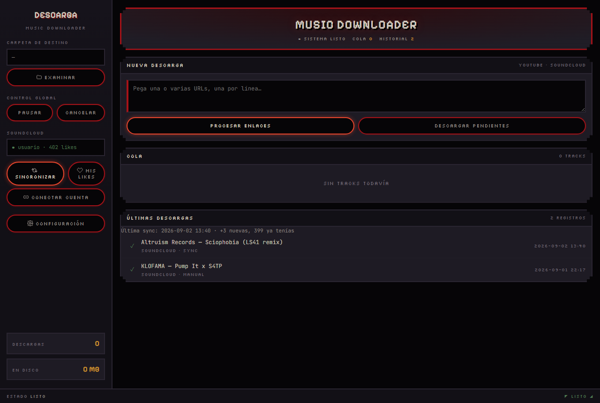

# 🎵 Music Downloader

Aplicación de escritorio para descargar música de **SoundCloud y YouTube**, con sincronización automática de tus likes, detección de duplicados (por nombre de archivo *y* por audio real), y detección de BPM/tonalidad para mezcla armónica.


[](https://github.com/Noull999/music-downloader/actions/workflows/test-multiplatform.yml)




## ✨ Características

- **SoundCloud API Integration**
  - Descarga automática de tus likes de SoundCloud
  - Sincronización periódica (manual o programada con el Task Scheduler de Windows)
  - Explorador de "Mis Likes" con estado de descarga y fecha

- **Detección de duplicados en dos capas**
  - Matching difuso de nombre de archivo contra toda tu biblioteca (no solo la carpeta de destino)
  - **Huella de audio (Chromaprint)** como red de seguridad: si el nombre no coincide con nada, compara el audio real de un preview antes de descargar — atrapa el caso de "mismo tema, nombre de archivo muy distinto" sin generar falsos positivos con remixes/edits de título parecido

- **BPM y tonalidad para DJs**
  - Detecta BPM y tonalidad (notación Camelot o musical) de cada descarga con `librosa`
  - Escribe los tags en el archivo (Serato/Rekordbox los leen directo, sin reanalizar)

- **Descargas Multi-formato**
  - MP3 (128/256/320 kbps), FLAC si está disponible
  - SoundCloud y YouTube

- **Post-procesamiento**
  - Metadatos y carátula incrustados
  - Normalización de volumen, eliminación de silencios

- **Interfaz de escritorio**
  - GUI moderna (pywebview) con tema oscuro y detalles neón
  - Cola de descargas en tiempo real, pausa/cancelación
  - Panel de "Últimas descargas" y de fallos permanentes (DRM/geo-bloqueo)
  - Empaquetada como **.exe standalone para Windows** — no requiere Python instalado

## 📋 Requisitos

**Para usar el .exe (Windows):** ninguno — ffmpeg y fpcalc van embebidos.

**Para correr o modificar el código fuente:**
- Python 3.9+ (3.12 recomendado; la detección de BPM/tonalidad requiere 3.12+)
- FFmpeg
- Dependencias en `requirements.txt` (yt-dlp, pywebview, mutagen, librosa, thefuzz, etc.)

## 🚀 Instalación

### Opción 1: .exe standalone (Windows, recomendado)

Compilá tu propio ejecutable firmado localmente:

```bash
pip install -r requirements.txt
python scripts/build.py
```

Esto genera `dist/MusicDownloader.exe` (descarga e incrusta ffmpeg y fpcalc automáticamente, y lo firma con un certificado autofirmado para que Windows Smart App Control no lo bloquee en tu PC).

### Opción 2: Desde código fuente

```bash
git clone https://github.com/Noull999/music-downloader.git
cd music-downloader
pip install -r requirements.txt
python main_webview.py
```

La GUI antigua de CustomTkinter (`python main.py`) sigue en el repo y funciona, pero `main_webview.py` es la interfaz activa.

Para instrucciones detalladas por sistema operativo, ver [SETUP.md](SETUP.md).

## ⚙️ Configuración de SoundCloud

Para sincronizar tus likes necesitás tu **OAuth Token** y **Client ID**:

1. Abrí soundcloud.com en tu navegador
2. Abrí DevTools (F12 → Network)
3. Buscá cualquier request a `api-v2.soundcloud.com`
4. En el header `Authorization` copiá el valor (formato: `OAuth 2-XXXXX...`)
5. En los query params buscá `client_id=XXXXX` y copialo

Ingresá estos valores desde "Conectar cuenta" en la app.

## 🎯 Uso

1. **Descarga manual** — pegá una o varias URLs de SoundCloud/YouTube y procesá los enlaces.
2. **Sincronizar** — conectá tu cuenta y sincronizá tus likes; la app se encarga de no re-descargar lo que ya tenés.
3. **Mis Likes** — explorá tus likes guardados, con estado de descarga y fecha, y bajá selecciones puntuales.
4. **Sincronización automática** — desde Configuración podés registrar una tarea programada de Windows para que sincronice sola cada X horas, incluso con la app cerrada.

## 📁 Estructura del Proyecto

```
music-downloader/
├── webview_app/            # Interfaz activa (pywebview)
│   ├── api.py              # Puente Python <-> JS
│   └── view.html           # UI completa (HTML/CSS/JS)
├── gui/                    # GUI legacy (CustomTkinter, sigue funcional)
├── handlers/                # Descargadores (SoundCloud, YouTube)
├── sync/                    # Sincronización de likes
│   ├── soundcloud_api.py
│   ├── sync_manager.py
│   ├── duplicate_checker.py # Matching difuso de nombres
│   └── task_scheduler.py    # Integración con Task Scheduler de Windows
├── analysis/                 # BPM/tonalidad y huella de audio
│   ├── audio_analysis.py     # Detección BPM/Camelot (librosa)
│   └── fingerprint.py        # Duplicados por audio (Chromaprint)
├── db/                       # Historial en SQLite
├── quality/                  # Post-procesamiento (ffmpeg, tags)
├── scripts/build.py          # Empaquetado del .exe
├── main_webview.py           # Entry point (GUI activa)
└── main.py                   # Entry point (GUI legacy)
```

## 🔧 Configuración avanzada

Desde el panel de Configuración de la app:

- **Patrón de nombre de archivo**: `{artist} - {title}`, `{title}`, o personalizado
- **Preset de calidad**: MP3 320/256/128 kbps, FLAC
- **Post-procesamiento**: normalización de volumen, eliminación de silencios, metadatos, carátula
- **Análisis de audio**: activar/desactivar BPM/tonalidad y elegir formato (Camelot o musical)
- **Duplicados por audio**: activado por defecto; se puede desactivar si preferís solo el matching por nombre

## 🐛 Troubleshooting

### "File not found after download"
- Verificá que FFmpeg esté instalado (o que el .exe lo tenga embebido): `ffmpeg -version`
- Probá con un preset diferente (ej: MP3 320kbps)

### "Invalid OAuth token"
- Regenerá el token en soundcloud.com (F12 → Network)
- Asegurate de copiar el valor completo con "OAuth 2-"

### "No new tracks found" en sync
- Los likes pueden tardar unos minutos en indexarse en la API de SoundCloud

### Windows bloquea el .exe (Smart App Control)
- `scripts/build.py` firma el .exe automáticamente con un certificado local. Si igual lo bloquea, revisá que el certificado quedó agregado a los almacenes `CurrentUser\Root` y `CurrentUser\TrustedPublisher`.

## 📊 Base de datos

El historial se guarda en `~/.music_downloader/history.db` (SQLite), con tablas separadas para descargas manuales, descargas por sync, likes guardados y fallos permanentes (DRM/geo-bloqueo).

## 🤝 Contribuciones

1. Fork el repo
2. Creá una rama para tu feature (`git checkout -b feature/AmazingFeature`)
3. Commit tus cambios
4. Push a la rama
5. Abrí un Pull Request

## ⚠️ Disclaimer

Esta herramienta es solo para uso personal. Respetá los términos de servicio de SoundCloud y YouTube. El autor no es responsable de mal uso.

## 📄 License

MIT — ver [LICENSE](LICENSE).

## 👨‍💻 Autor

**José Esteban Asencio**
- GitHub: [@Noull999](https://github.com/Noull999)
- Email: joseestebanasencio@gmail.com

---

⭐ Si te fue útil, considerá darle una estrella al proyecto!
