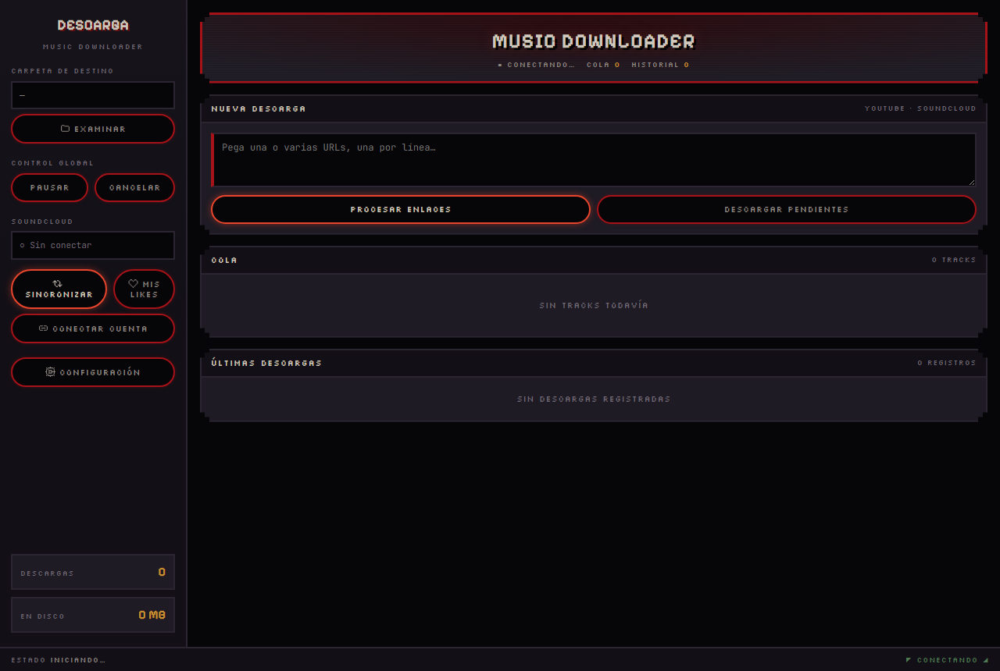

# 🎵 Music Downloader

Aplicación de escritorio para descargar música de **SoundCloud y YouTube**, con sincronización automática de tus likes, organización en carpetas por subgénero, detección de duplicados (por nombre de archivo *y* por audio real), y detección de BPM/tonalidad para mezcla armónica.

**Página del proyecto:** [noull999.github.io/music-downloader](https://noull999.github.io/music-downloader/)


[](https://github.com/Noull999/music-downloader/actions/workflows/test-multiplatform.yml)




## ✨ Características

- **SoundCloud API Integration**
  - Descarga automática de tus likes de SoundCloud
  - Sincronización periódica (manual o programada con el Task Scheduler de Windows)
  - Explorador de "Mis Likes" con estado de descarga, fecha y **carpeta donde quedó cada canción** (clic para abrirla); avisa con ⚠ si un like quedó enlazado a un archivo que no se le parece
  - **Si SoundCloud no deja descargar un tema** (DRM, restringido), la app lo busca en YouTube y lo baja de ahí si encuentra una coincidencia confiable (misma duración y título parecido); también hay un botón "Probar desde YouTube" en el panel de fallos
  - Asistente de conexión: inicias sesión en SoundCloud desde la app y el Client ID se detecta solo

- **Descubrir música sin descargar a ciegas**
  - Al pegar un link de **lista, perfil o set** (YouTube o SoundCloud) se abre una ventana para elegir cuáles temas agregar, en vez de bajarlos todos
  - **"Parecidos"**: temas recomendados a partir de un like, un video o tus últimos likes (**"✦ Descubrir temas"**), con tope de 50
  - **Vista previa** con ▶ en cada fila, desde el 35% del tema, para decidir sin descargar
  - Nada se descarga solo: las sugerencias solo se bajan si las marcas

- **Organización automática por subgénero**
  - Cada descarga va sola a la carpeta de su género (`Schranz/`, `Hardgroove/`, `Industrial Techno/`…), sin elegir nada por canción
  - El subgénero se resuelve leyendo los **tags** de SoundCloud, no solo el campo `genre`, que el uploader suele dejar en algo genérico. Medido sobre una biblioteca real de 402 canciones: 34% tenían género genérico mientras el subgénero estaba en los tags, y *schranz* aparecía 57 veces en los tags contra 14 en `genre`
  - Cadena de respaldo cuando el tema no trae género: tags y descripción (YouTube), **otros temas del mismo artista** y búsqueda en SoundCloud; solo se acepta si hay consenso suficiente, si no va a "Sin género"
  - Reusa las carpetas que ya tengas (ignorando mayúsculas) y descarta basura como categorías de YouTube (`Music`, `Entertainment`) o volcados de tags
  - Panel **"Ordenar la música que ya tengo"**: vista previa de a qué carpeta iría cada canción antes de mover nada, con archivo de deshacer

- **Detección de duplicados en dos capas**
  - Matching difuso de nombre de archivo contra toda tu biblioteca (no solo la carpeta de destino), ignorando archivos basura (`.DS_Store`, `._*` de macOS) que si no se cuentan como canciones reales
  - **Huella de audio (Chromaprint)** como red de seguridad: si el nombre no coincide con nada, compara el audio real de un preview antes de descargar — atrapa el caso de "mismo tema, nombre de archivo muy distinto" sin generar falsos positivos con remixes/edits de título parecido
  - Distingue remixes: si el título lleva el nombre del remixer (`(SX2 Remix)`) no se da por duplicado de otra versión, y un tema de duración distinta tampoco
  - Soporta MP3, WAV, FLAC, M4A, AAC, OGG, OPUS, AIFF

- **BPM y tonalidad para DJs**
  - Detecta BPM y tonalidad (notación Camelot o musical) de cada descarga con `librosa`
  - Escribe los tags en el archivo (Serato/Rekordbox los leen directo, sin reanalizar)

- **Descargas Multi-formato**
  - MP3 (128/256/320 kbps), FLAC si está disponible
  - SoundCloud y YouTube

- **Post-procesamiento**
  - Metadatos, género y carátula incrustados en **MP3, WAV y AIFF** (no solo MP3)
  - La carátula se normaliza a JPEG y máx. 600px: SoundCloud a veces entrega miniaturas de 100×100 y YouTube las da en WebP, que Serato no muestra
  - Normalización de volumen y eliminación de silencios al inicio y al final, sin cortar temas con pausas en medio
  - Tags **ID3v2.3**, para que la carátula y los datos se vean también en el Explorador de Windows y Windows Media Player
  - **"Completar tags rotos"** (opcional): con una API key gratuita de AcoustID, rellena título y artista de archivos sin tags (nunca pisa los que ya existen)

- **Interfaz de escritorio**
  - GUI moderna (pywebview) con tema oscuro y detalles neón
  - Cola de descargas en tiempo real, pausa/cancelación
  - Panel de "Últimas descargas" (con la carpeta de cada una) y de fallos permanentes (DRM/geo-bloqueo)
  - Historial fiable: "ya descargada" exige que el archivo exista, y los contadores cuentan solo descargas reales
  - Empaquetada como **.exe standalone para Windows** y como **.app para macOS** — no requiere Python instalado

## 📋 Requisitos

**Para usar el .exe (Windows):** ninguno — ffmpeg y fpcalc van embebidos.

**Para correr o modificar el código fuente:**
- Python 3.9+ (3.12 recomendado; la detección de BPM/tonalidad requiere 3.12+)
- FFmpeg
- Dependencias en `requirements.txt` (yt-dlp, pywebview, mutagen, librosa, thefuzz, etc.)

## 🚀 Instalación

### Opción 1: .exe standalone (Windows, recomendado)

Compilá tu propio ejecutable firmado localmente:

```bash
pip install -r requirements.txt
python scripts/build.py
```

Esto genera `dist/MusicDownloader.exe` (descarga e incrusta ffmpeg y fpcalc automáticamente, y lo firma con un certificado autofirmado para que Windows Smart App Control no lo bloquee en tu PC).

### Opción 2: App para macOS (.app)

No hace falta un Mac para armarla: en GitHub → pestaña **Actions** → **Build macOS** → **Run workflow**. Al terminar (unos 10 minutos) aparece como descarga `MusicDownloader-mac-apple-silicon.zip` (Macs M1/M2/M3...) y `MusicDownloader-mac-intel.zip`. Si subís una etiqueta (`git tag v1.0.0 && git push --tags`) también queda en **Releases**, con un link directo para mandárselo a alguien.

Quien la reciba:

1. Descomprime el `.zip` y arrastra `MusicDownloader.app` a *Aplicaciones*.
2. La primera vez: **clic derecho → Abrir → Abrir** (Mac avisa de "desarrollador no identificado" porque la app no está firmada con una cuenta de Apple de pago; solo pasa la primera vez).
3. La app abre sola un asistente para conectar SoundCloud: inicia sesión ahí y listo. Es opcional; descargar con links funciona sin eso.

Incluye ffmpeg y fpcalc; no hay que instalar nada más.

### Opción 3: Desde código fuente

```bash
git clone https://github.com/Noull999/music-downloader.git
cd music-downloader
pip install -r requirements.txt
python main_webview.py
```

ffmpeg y Chromaprint (`fpcalc`) tienen que estar instalados y en el PATH al correr desde código fuente (en Windows: `winget install Gyan.FFmpeg`; en macOS: `brew install ffmpeg chromaprint`). Los ejecutables ya los traen incluidos.

## ⚙️ Configuración de SoundCloud

La primera vez que abrís la app aparece un asistente: **"Iniciar sesión en SoundCloud"** abre una ventana con la página de SoundCloud, iniciás sesión ahí (la app no ve tu contraseña) y se conecta sola, incluido el Client ID. También se abre desde "Conectar cuenta". Es opcional: descargar con links funciona sin cuenta.

La ventana de inicio de sesión **no admite Google, Facebook ni Apple** (abren ventanas emergentes que la app no puede mostrar): ahí entrá con tu correo. Si tu cuenta es de esas, usá el **modo manual** del mismo asistente:

1. Abrí soundcloud.com en tu navegador e iniciá sesión (el asistente tiene un link para eso).
2. Abrí la consola: **Ctrl + Shift + J** (Shift es la flecha ⇧, no Bloq Mayús; en Mac **Cmd + Opción + J**), o F12 → pestaña *Console*.
3. Pegá la línea que muestra el asistente (botón *Copiar línea*) y Enter. Si Chrome lo pide, escribí antes `allow pasting` + Enter. La consola solo responde `undefined`: es normal, el token ya quedó copiado en tu portapapeles.
4. Volvé a la app, hacé clic en **OAuth Token** y pegá con Ctrl+V (empieza con `2-`; el prefijo `OAuth` lo agrega la app). El Client ID se completa solo.
5. **Verificar y conectar**: debe aparecer `✅ ¡Conectado!` con tu usuario.

Si la consola responde `no encontrado`, usá DevTools → *Network* → cualquier request a `api-v2.soundcloud.com` → header `Authorization`.

## 🎯 Uso

1. **Descarga manual** — pegá una o varias URLs de SoundCloud/YouTube y procesá los enlaces.
2. **Sincronizar** — conectá tu cuenta y sincronizá tus likes; la app se encarga de no re-descargar lo que ya tenés.
3. **Mis Likes** — explorá tus likes guardados, con estado de descarga y fecha, y bajá selecciones puntuales.
4. **Sincronización automática** — desde Configuración podés registrar una tarea programada de Windows para que sincronice sola cada X horas, incluso con la app cerrada.
5. **Ordenar por género** — activá "Ordenar por género en carpetas" y cada descarga nueva cae sola donde corresponde. Si ya tenés música suelta, el botón "Ordenar la música que ya tengo" la acomoda: primero te muestra la simulación, y solo mueve si confirmás.

### Sincronización automática

Se programa desde la app (Windows: Programador de tareas; macOS: `launchd`). Si el equipo estaba apagado o dormido a la hora programada, sincroniza al encenderse o despertar.

## 📁 Estructura del Proyecto

```
music-downloader/
├── webview_app/            # Interfaz activa (pywebview)
│   ├── api.py              # Puente Python <-> JS
│   └── view.html           # UI completa (HTML/CSS/JS)
├── gui/ui_controller.py    # Controlador compartido (config, historial, descargas)
├── handlers/                # Descargadores (SoundCloud, YouTube)
├── sync/                    # Sincronización de likes
│   ├── soundcloud_api.py
│   ├── sync_manager.py
│   ├── duplicate_checker.py # Matching difuso de nombres
│   ├── genre_utils.py       # Resolución de subgénero (genre + tags + título)
│   └── task_scheduler.py    # Integración con Task Scheduler de Windows
├── analysis/                 # BPM/tonalidad y huella de audio
│   ├── audio_analysis.py     # Detección BPM/Camelot (librosa)
│   └── fingerprint.py        # Duplicados por audio (Chromaprint)
├── db/                       # Historial en SQLite
├── quality/                  # Post-procesamiento (ffmpeg, tags)
├── scripts/build.py          # Empaquetado (.exe en Windows, .app en macOS)
└── main_webview.py           # Entry point
```

## 🔧 Configuración avanzada

Desde el panel de Configuración de la app:

- **Patrón de nombre de archivo**: `{artist} - {title}`, `{title}`, o personalizado
- **Preset de calidad**: MP3 320/256/128 kbps, FLAC
- **Post-procesamiento**: normalización de volumen, eliminación de silencios, metadatos, carátula, género
- **Ordenar por género en carpetas**: las carpetas se crean en la raíz de tu biblioteca (no dentro de la carpeta de descarga), y la app te muestra la ruta exacta
- **Análisis de audio**: activar/desactivar BPM/tonalidad y elegir formato (Camelot o musical)
- **Duplicados por audio**: activado por defecto; se puede desactivar si preferís solo el matching por nombre

## 🐛 Troubleshooting

### "File not found after download"
- Verificá que FFmpeg esté instalado (o que el .exe lo tenga embebido): `ffmpeg -version`
- Probá con un preset diferente (ej: MP3 320kbps)

### "Invalid OAuth token"
- Regenerá el token en soundcloud.com (F12 → Network)
- Asegurate de copiar el valor completo con "OAuth 2-"

### "No new tracks found" en sync
- Los likes pueden tardar unos minutos en indexarse en la API de SoundCloud

### "HTTP Error 403: Forbidden" al consultar SoundCloud
- Es un límite de tasa temporal de SoundCloud, no un problema de la cuenta ni del código. Aparece si se hacen muchas consultas seguidas (por ejemplo, reprocesando metadatos de decenas de canciones de una sola vez). Esperá unos minutos y volvé a intentar.

### Windows bloquea el .exe (Smart App Control)
- `scripts/build.py` firma el .exe automáticamente con un certificado local. Si igual lo bloquea, revisá que el certificado quedó agregado a los almacenes `CurrentUser\Root` y `CurrentUser\TrustedPublisher`.

### La primera sync tarda muchísimo (varios minutos, sin avisar nada)
- Es la construcción inicial del índice de huellas de audio (`analysis/fingerprint.py`), que le saca la huella a toda tu biblioteca la primera vez. Un antivirus con protección en tiempo real puede escanear cada apertura de `fpcalc.exe` y volverlo bastante más lento que corrido fuera del .exe — es esperable solo la primera vez; después queda cacheado (`~/.music_downloader/fingerprint_index.json`) y solo recalcula lo nuevo o cambiado.
- Reorganizar la biblioteca por género (o cualquier operación que MUEVA archivos existentes) actualiza ese caché en vez de borrarlo — remapea las rutas sin recalcular nada, porque el contenido del audio no cambió.

## 📊 Base de datos

El historial se guarda en `~/.music_downloader/history.db` (SQLite), con tablas separadas para descargas manuales, descargas por sync, likes guardados (incluidos sus tags, para resolver el subgénero) y fallos permanentes (DRM/geo-bloqueo).

En esa misma carpeta quedan el índice de huellas de audio (`fingerprint_index.json`, cacheado por fecha y tamaño para no re-analizar la biblioteca entera en cada sync) y los archivos `undo_organizar_*.json` que genera el ordenado por género.

## 🤝 Contribuciones

1. Fork el repo
2. Creá una rama para tu feature (`git checkout -b feature/AmazingFeature`)
3. Commit tus cambios
4. Push a la rama
5. Abrí un Pull Request

## ⚠️ Disclaimer

Esta herramienta es solo para uso personal. Respetá los términos de servicio de SoundCloud y YouTube. El autor no es responsable de mal uso.

## 📄 License

MIT — ver [LICENSE](LICENSE).

## 👨‍💻 Autor

**José Esteban Asencio**
- GitHub: [@Noull999](https://github.com/Noull999)
- Email: joseestebanasencio@gmail.com

---

⭐ Si te fue útil, considerá darle una estrella al proyecto!
